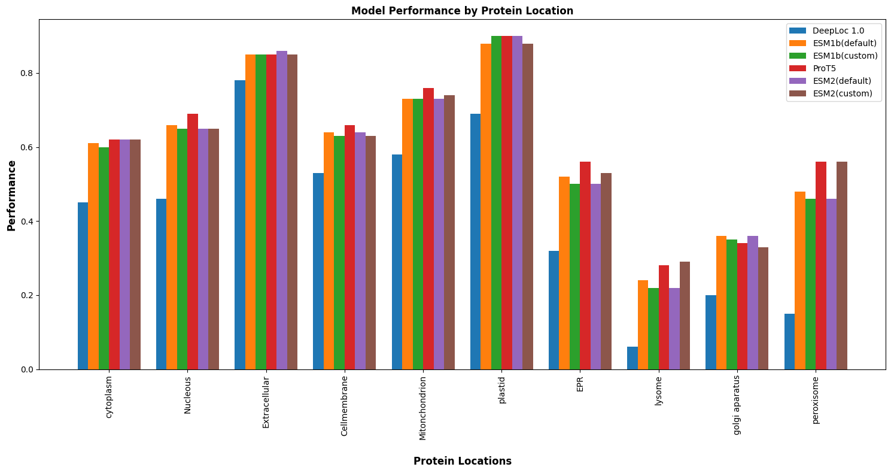

# deeploc-upgrade

## Introduction

In this project, we aim to further improve DeepLoc 2.0. We propose enhancing its performance and interpretability by improving and extending the dataset utilized. Our goal is to achieve even higher accuracy and provide more detailed insights into protein localization, making DeepLoc 2.0 an even more powerful tool for proteomics research. The updated version of DeepLoc 2.0 will continue to use the same architecture, ensuring its attributes such as speed and efficiency are maintained. By improving its accuracy, we aim to make it an indispensable resource for researchers in the field of protein subcellular localization.

## Methodology

We chose to enhance DeepLoc 2.0 instead of enhancing the light attention model due to its integrated features, established community adoption, and efficiency in development. By building upon DeepLoc 2.0's existing capabilities such as multi-localization prediction and accurate sorting signal identification, we ensure a unified tool for protein subcellular localization. This approach optimizes resources, maintains consistency in prediction methodologies, and supports domain-specific enhancements tailored for higher accuracy and compatibility with existing research workflows.We utilized the code from TviNet/DeepLoc-2.0 to initialize training.

## Dataset
- SwissProt Localization Dataset
- Human Protein Atlas (HPA)
- Sorting Signals Dataset

## Models
- ESM1b: Evolutionary Scale Mixture model known for capturing evolutionary features in protein sequences.
- ESM2: Enhanced version of ESM1b, refining sequence embeddings and predictive capabilities.
- ProtT5: Transformer-based model optimized for processing protein sequences efficiently.
- ProtT5 half-precision: ProtT5 model configured for improved computational efficiency without compromising performance.

## Run Comparison

